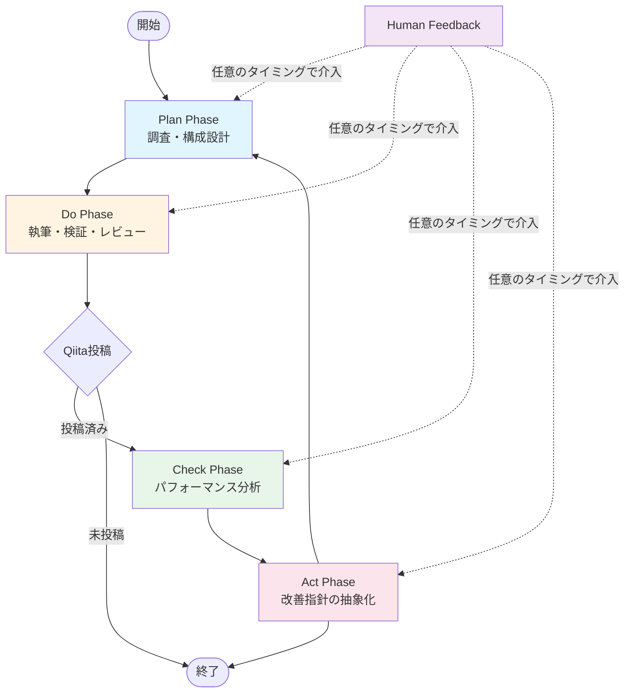
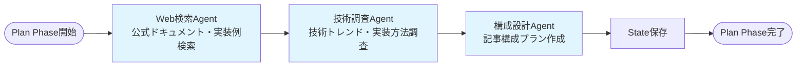
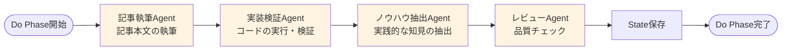
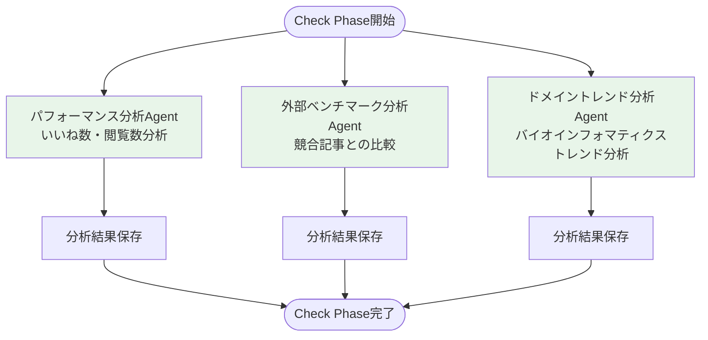
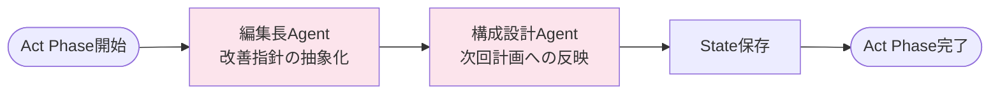
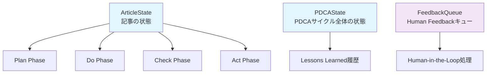
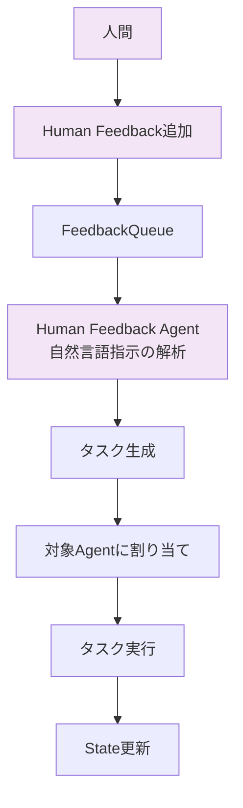

# CrewAIワークフロー全体図

このドキュメントでは、CrewAIベースのPDCAサイクルシステムのアーキテクチャとワークフローを説明します。

## システム概要

本システムは、CrewAIフレームワークを使用して、Qiita記事の生成から分析、改善までを自動化するPDCAサイクルを実現します。各Phaseは複数のAgentとTaskで構成され、Human-in-the-Loop機能により人間の介入が可能です。

## PDCAサイクル全体フロー



## Plan Phase（調査・構成設計）



### AgentとTask

- **Web検索Agent**: 公式ドキュメント、実装例ブログ、GitHubリポジトリを検索
- **技術調査Agent**: 技術の概要、最新トレンド、実装方法、バイオインフォマティクスへの応用可能性を調査
- **構成設計Agent**: 調査結果を基に記事構成プラン（タイトル、セクション、コード例の配置）を設計

## Do Phase（執筆・検証・レビュー）



### AgentとTask

- **記事執筆Agent**: 構成プランに基づいて記事本文を執筆（Markdown形式）
- **実装検証Agent**: 記事内のPythonコードを実際に実行し、エラーを検出・修正案を提示
- **ノウハウ抽出Agent**: Web検索結果、技術調査結果、実装検証結果から実践的なノウハウを抽出
- **レビューAgent**: 技術的正確性、構成の論理性、コード例の完全性、文字数、セクション完全性をチェック

## Check Phase（パフォーマンス分析）



### AgentとTask

- **パフォーマンス分析Agent**: 投稿後の記事のKPI（いいね数、閲覧数、コメント数）を分析
- **外部ベンチマーク分析Agent**: 同じタグ・トピックの他記事との比較分析
- **ドメイントレンド分析Agent**: バイオインフォマティクス領域の最新トレンドを分析し、次回記事のトピック候補を提案

## Act Phase（改善指針の抽象化）



### AgentとTask

- **編集長Agent**: レビュー結果と分析結果を統合し、今後の記事作成に活かすための具体的な改善指針を抽象化
- **構成設計Agent**: 改善指針を次回の記事計画に反映する方法を検討

## State管理



### Stateの種類

- **ArticleState**: 個別記事の状態（トピック、調査結果、構成プラン、記事本文、レビュー結果、KPI、分析結果など）
- **PDCAState**: PDCAサイクル全体の状態（現在のPhase、Lessons Learned履歴など）
- **FeedbackQueue**: Human Feedbackのキュー管理

## Human-in-the-Loop機能



### 介入ポイント

- **任意のPhaseで介入可能**: Plan、Do、Check、ActのどのPhaseでもHuman Feedbackを追加可能
- **自然言語指示**: 「タイトルを変更して」「コード例を追加して」などの自然言語で指示可能
- **優先度設定**: フィードバックに優先度を設定可能（1-10、10が最高優先度）

## ツール

各Agentは以下のツールを使用できます：

- **Gemini Tool**: Gemini APIを呼び出してテキスト生成
- **Qiita Tool**: Qiita APIから記事を取得・投稿
- **State Tool**: ArticleState、PDCAStateの保存・読み込み
- **File Tool**: Markdownファイルの読み込み・書き込み、ドラフトファイルの読み込み
- **Web検索Tool**: 公式ドキュメント、実装例ブログ、GitHubリポジトリの検索
- **コード実行Tool**: Pythonコードの実行・検証

## データフロー

```mermaid
graph LR
    Draft[ドラフトファイル] --> Plan[Plan Phase]
    Plan --> State1[ArticleState<br/>plan, research_report]
    State1 --> Do[Do Phase]
    Do --> State2[ArticleState<br/>content, review_result]
    State2 --> Publish[Qiita投稿]
    Publish --> State3[ArticleState<br/>qiita_url, qiita_item_id]
    State3 --> Check[Check Phase]
    Check --> State4[ArticleState<br/>analysis_results]
    State4 --> Act[Act Phase]
    Act --> PDCA[PDCAState<br/>lessons_learned_history]
    PDCA --> Plan
    
    style Draft fill:#fff4e1
    style State1 fill:#e1f5ff
    style State2 fill:#e1f5ff
    style State3 fill:#e1f5ff
    style State4 fill:#e1f5ff
    style PDCA fill:#e1f5ff
```



## ディレクトリ構造

```
src/crewai/
├── agents/              # Agent定義
│   ├── researcher.py
│   ├── planner.py
│   ├── writer.py
│   ├── reviewer.py
│   ├── web_researcher.py
│   ├── implementation_verifier.py
│   ├── knowledge_extractor.py
│   ├── performance_analyst.py
│   ├── external_benchmark_analyst.py
│   ├── domain_trend_analyst.py
│   ├── editor_in_chief.py
│   └── human_feedback_agent.py
├── tasks/               # Task定義
│   ├── plan_tasks.py
│   ├── do_tasks.py
│   ├── check_tasks.py
│   ├── act_tasks.py
│   └── verification_tasks.py
├── crews/               # Crew定義
│   ├── plan_crew.py
│   ├── do_crew.py
│   ├── check_crew.py
│   └── act_crew.py
├── tools/               # Tool定義
│   ├── gemini_tool.py
│   ├── qiita_tool.py
│   ├── state_tool.py
│   ├── file_tool.py
│   ├── web_search_tool.py
│   └── code_execution_tool.py
├── state/               # State管理
│   ├── article_state.py
│   ├── pdca_state.py
│   └── feedback_queue.py
├── human_loop.py        # Human-in-the-Loop処理
└── orchestrator.py      # メインオーケストレーター
```

## 実行フロー

1. **初期化**: `PDCAOrchestrator`がArticleStateとPDCAStateを初期化
2. **Plan Phase**: Web検索 → 技術調査 → 構成設計
3. **Do Phase**: 記事執筆 → 実装検証 → ノウハウ抽出 → レビュー
4. **投稿**: Do Phase完了後、`--auto-publish`が指定されている場合はQiitaに投稿
5. **Check Phase**: 投稿後、パフォーマンス分析 → 外部ベンチマーク分析 → ドメイントレンド分析
6. **Act Phase**: 改善指針の抽象化 → 次回計画への反映
7. **繰り返し**: Act Phase完了後、次のPDCAサイクルに進む

## 設定ファイル

`config/config.json`で以下の設定が可能です：

- **LLM設定**: モデル名、温度、最大トークン数
- **Agent設定**: 各Agentのmax_iter、verbose
- **Crew設定**: 各Crewのprocess、verbose
- **State設定**: Stateファイルの保存先ディレクトリ

## 拡張ポイント

- **新しいAgentの追加**: `src/crewai/agents/`に新しいAgentを追加
- **新しいToolの追加**: `src/crewai/tools/`に新しいToolを追加
- **新しいTaskの追加**: `src/crewai/tasks/`に新しいTaskを追加
- **新しいPhaseの追加**: `src/crewai/crews/`に新しいCrewを追加

