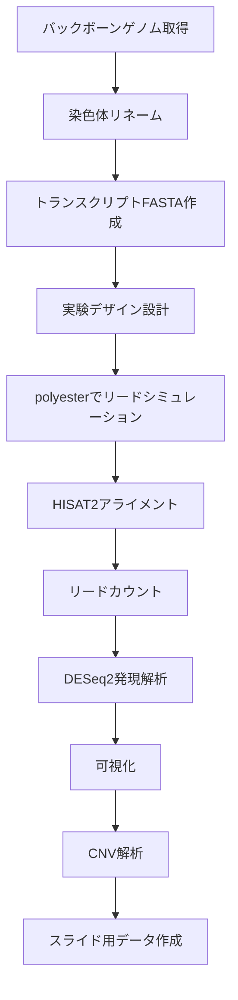

# 第1回：モンスターハンターの世界で学ぶバイオインフォマティクス

## はじめに

こんにちは！今回は、モンスターハンターの世界に登場する「リオス科」という架空の飛竜種を題材に、RNA-seq解析を学ぶプロジェクトをご紹介します。

「RNA-seq解析って難しそう...」「実際のデータがないと勉強できないのでは？」と思っている方も多いかもしれません。しかし、**仮想ゲノムとシミュレーションデータを使えば、自分のペースで解析手法を学べます**。
了解。**短く・読みやすく**まとめるね。

## 対象読者

本シリーズは、以下のような方を想定しています。

* RNA-seq解析に興味はあるが、実データや環境構築が難しいと感じている方
* バイオインフォマティクス初学者〜初中級者
* Python / R / Linux に少し触れたことがある理系・エンジニア
* モンスターハンターの世界観を科学的に楽しみたい方

**シミュレーションデータ**を使うため、専門知識がなくても安全に、実践的なRNA-seq解析を学べます。

---

このシリーズでは、初心者にも分かりやすく、かつ実践的な内容で、RNA-seq解析の一連の流れを解説していきます。
以下が具体的なこのシリーズの学習テーマになります！


---

## パイプライン全体図

このシリーズでは、以下の9ステップでRNA-seq解析の一連の流れを学びます：

```
[1] イントロダクション ← 現在ここ
[2] 環境構築
[3] データ準備
[4] シミュレーション
[5] アライメント・カウント
[6] 発現解析
[7] 可視化
[8] CNV解析
[9] まとめ
```

各記事では、このパイプライン全体図と現在のステップを示すことで、**自分がどの段階にいるのか**を常に確認しながら進められます。

<!-- TODO: 画像URLを設定してください: パイプライン全体図（ステップ1をハイライト） -->
<!--  -->

---

## プロジェクトの背景：リオス科の性的二形

### リオレウス（オス）とリオレイア（メス）

リオス科は、極端な性的二形を示す飛竜種として知られています：


- **リオレウス（オス）**：「空の王者」として、翼が大きく発達し、優れた飛行能力を持ちます
- **リオレイア（メス）**：「巣の守護者」として、尾棘と毒腺が発達し、地上戦に特化しています

このような形態差は、どのような遺伝的基盤によって生み出されるのでしょうか？

### 仮説：遺伝子発現とコピー数変動

私たちは、以下の仮説を立てました：

1. **Hox遺伝子の発現ドメインシフト**
   - オス：翼基部でHox発現が前方シフト → 翼の成長が促進
   - メス：尾椎領域でHox発現が後方シフト → 尾棘の形成が強化

2. **CNV（コピー数変動）による形態分化**
   - オス：翼基部軟骨形成遺伝子（BMP/Wnt系）のコピー数増加
   - メス：尾棘・毒腺関連遺伝子のコピー数増加

3. **性選択と役割分担**
   - オス：探索・急襲に適した形態
   - メス：防衛・巣保護に適した形態


---

## なぜ「仮想ゲノム」なのか？

### 現実のデータ解析の課題

実際の生物で性差や形態進化を調べるには：

- 複数種・複数個体のゲノム配列が必要
- 組織別RNA-seqデータの取得に時間とコストがかかる
- 実験的検証（遺伝子改変など）は倫理的・技術的制約がある

### 仮想ゲノムの利点

**仮想ゲノム・シミュレーションデータ**を使えば：

- 研究仮説（「オスで翼遺伝子が高発現」「メスで尾棘遺伝子がCNV増加」など）を**先に設計**できる
- その仮説に基づいて「データがどう見えるか」を**予測・再現**できる
- 解析パイプラインの動作確認や、統計手法の検証に使える

つまり、**「仮説駆動型の学習・検証ツール」**として機能します。


---

## プロジェクトの全体像

### 使用する技術スタック

このプロジェクトでは、以下の技術を使用します：

**ゲノム・アノテーション**
- バックボーン：Gallus gallus (ニワトリ) GRCg7b
- アノテーション：Ensembl release 112

**RNA-seq解析**
- シミュレーション：polyester (R/Bioconductor)
- アライメント：HISAT2
- カウント：カスタム関数（トランスクリプトベース）
- 発現解析：DESeq2

**CNV解析**
- ツール：Control-FREEC（予定）
- データ形式：BED/VCF

**可視化**
- R: ggplot2, pheatmap
- Python: matplotlib, seaborn

### プロジェクト構成

```
MonsterGenome_Rios/
├── docs/              # 仕様書、実験計画、ブログ記事
├── reference/         # バックボーンFASTA/GTF（シンボリックリンク）
├── simulation/        # シミュレーション入力（設計CSV、発現行列）
├── analysis/          # RNA-seq解析スクリプト
├── scripts/           # 共有ユーティリティ
└── data/              # 生成データ（実際は/home/uecha/data/に配置）
```

### ワークフロー概要




---

## このシリーズで学べること

### 1. 環境構築とデータ準備
- conda環境の構築
- バックボーンゲノムの取得
- ディレクトリ構成の設計

### 2. RNA-seqシミュレーション
- トランスクリプト設計
- 実験デザインの考え方
- polyesterによるリード生成

### 3. アライメントとカウント
- アライメント戦略の選択
- カウント方法の実装
- デバッグのコツ

### 4. 発現解析
- DESeq2の使い方
- 統計モデルの設計
- 結果の解釈

### 5. 可視化
- 火山図、ヒートマップ、PCA
- グラフの読み方
- 結果の解釈

### 6. CNV解析
- CNV領域の定義
- 期待値と検出値の比較
- スライド用データの作成

---

## 次のステップ

次回は、**環境構築**について詳しく解説します。ターミナル操作の基本から、conda環境の構築、ディレクトリ構成の設計まで、初心者にも分かりやすく説明します。

お楽しみに！

---
