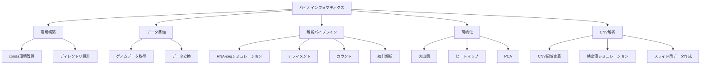

# 第9回：まとめと今後の展望「仮想ゲノム解析から学んだこと」

## はじめに

これまで8回にわたって、仮想ゲノム解析プロジェクトの全体像を解説してきました。最終回となる今回は、**プロジェクト全体の振り返りと今後の展望**について説明します。

---

## プロジェクト全体の成果サマリー

### 完了した作業

1. **環境構築とデータ準備** ✅
   - conda環境の構築
   - バックボーンゲノム（Gallus gallus GRCg7b）の取得
   - 染色体リネーム（chr1→Rios1など）

2. **トランスクリプト設計とRNA-seqシミュレーション** ✅
   - 14遺伝子の選定とトランスクリプトFASTA作成
   - 実験デザイン（19サンプル）の設計
   - polyesterによるリード生成（約380M reads）

3. **アライメントとカウント** ✅
   - HISAT2トランスクリプトインデックスの作成
   - アライメント実行（マッピング率99.99%）
   - カスタムカウント関数によるリードカウント

4. **発現解析** ✅
   - DESeq2による性差・組織差の検出
   - 3遺伝子が有意（FDR<0.05）
   - 設計通りの発現パターンが確認された

5. **可視化** ✅
   - 火山図、ヒートマップ、PCAの作成
   - 性差・組織差の主要所見を可視化

6. **CNV解析** ✅
   - CNV領域の定義（BEDファイル）
   - 期待値と検出値の比較（相関係数 r = 0.998）
   - スライド用データの自動生成

7. **スライド用データ作成** ✅
   - Page 14-17用のデータを作成
   - 統一JSON形式で出力

### 生成されたファイル

```
analysis/out/
├── *.bam                    # 19サンプルのアライメント結果
├── gene_counts.txt          # カウントマトリクス
├── dds.rds                  # DESeq2オブジェクト
├── vst.rds                  # rlog変換オブジェクト
├── plots/                   # 可視化結果
│   ├── volcano_sex_M_vs_F.png
│   ├── heatmap_all_genes.png
│   └── pca_plot.png
└── slide_data/              # スライド用データ
    ├── page14_*.csv/json
    ├── page15_*.csv/json
    ├── page16_*.csv/json
    └── page17_*.csv/json
```

<!-- TODO: 画像URLを設定してください: プロジェクト全体の成果サマリー図 -->
<!--  -->

---

## 学んだ技術と知識

### 1. 環境管理

- **conda環境の構築**：複数の環境を使い分ける重要性
- **ディレクトリ構成の設計**：大容量データの効率的な管理
- **シンボリックリンクの活用**：データの共有と容量節約

### 2. RNA-seq解析パイプライン

- **シミュレーションデータの生成**：polyesterの使い方
- **アライメント戦略の選択**：ゲノム vs トランスクリプト
- **カウント方法の実装**：featureCountsの限界とカスタム関数
- **統計解析**：DESeq2のデザイン式とモデル設計

### 3. 可視化と解釈

- **火山図**：発現変動の大きさと統計的有意性
- **ヒートマップ**：遺伝子×サンプルの発現パターン
- **PCA**：サンプル間の関係性

### 4. CNV解析

- **CNV領域の定義**：BEDファイルの作成
- **期待値と検出値の比較**：シミュレーションデータの検証
- **スライド用データの自動生成**：統一JSON形式

---

## 技術スタックの習得度マップ



<!-- TODO: 画像URLを設定してください: 技術スタックの習得度マップ図 -->
<!--  -->

---

## 今後の展開

### 1. Page 18: 視覚・色覚遺伝子解析

現在のデータには、オプシン遺伝子とretina/visual_cortexサンプルが含まれていません。Page 18を作成するには：

- **オプシン遺伝子の追加**：4つのオプシン遺伝子（LWS, MWS, SWS, Rh1）を追加
- **実験デザインの拡張**：retinaとvisual_cortexサンプルを追加
- **データ再生成**：新しいリードをシミュレート
- **発現解析**：オプシン遺伝子の性差を検出

### 2. 実際のControl-FREEC実行

現在のデータはトランスクリプトアライメントのため、実際のControl-FREEC実行には：

- **ゲノムアライメント**：STAR/HISAT2ゲノムインデックスの作成
- **Control-FREEC設定**：GC補正、マスキングなどの設定
- **CNV検出**：実際のBAMファイルからCNVを検出
- **検証**：期待値と検出値の比較

### 3. より詳細な解析

- **ゲノムワイドCNV解析**：14遺伝子以外のCNV領域も検出
- **亜種間比較**：より多くの亜種サンプルで比較
- **発生段階別解析**：発生段階ごとの発現パターン
- **環境適応解析**：生息環境による発現差

---

## 読者へのアドバイス

### 初心者向け

1. **小さく始める**：最初は少数の遺伝子・サンプルで試す
2. **エラーを恐れない**：エラーメッセージから学ぶ
3. **ドキュメントを読む**：公式ドキュメントを参照
4. **コミュニティに参加**：質問や議論に参加する

### 中級者向け

1. **パイプラインを理解する**：各ツールの役割を理解
2. **統計モデルを理解する**：DESeq2のデザイン式の意味
3. **可視化を活用する**：グラフで結果を理解
4. **再現性を重視する**：スクリプトとパラメータを記録

---

## プロジェクトの学術的価値

### 教育・学習ツールとして

- **「仮説→データ生成→解析→検証」の一連の流れ**を体験できる
- 現実のデータ解析では「なぜこの結果が出たか」が不明なことが多いが、シミュレーションでは**原因が分かっている**ため、解析手法の理解が深まる

### 方法論の検証ツールとして

- 新しい解析パイプラインを開発した際、**既知の答えがあるデータ**で動作確認できる
- 統計手法（DESeq2のパラメータ調整など）の効果を定量的に評価できる

### 世界観構築ツールとして

- 架空生物の「科学的説明」を、現実の生物学原理に基づいて構築できる
- フィクションと科学の接点を探る試み

---

## まとめ

このシリーズでは、仮想ゲノム解析プロジェクトを通じて、RNA-seq解析の一連の流れを学びました：

1. **環境構築**：conda環境とディレクトリ構成
2. **データ準備**：バックボーンゲノムの取得とリネーム
3. **シミュレーション**：polyesterによるリード生成
4. **アライメント**：HISAT2によるマッピング
5. **カウント**：トランスクリプトベースのカウント
6. **発現解析**：DESeq2による統計検定
7. **可視化**：火山図、ヒートマップ、PCA
8. **CNV解析**：期待値と検出値の比較

**主要な成果**：
- 設計通りの性差・組織差が統計的に検出された
- CNVシミュレーションの高精度が確認された（r = 0.998）
- スライド用データが自動生成された

**今後の課題**：
- Page 18のオプシン遺伝子解析
- 実際のControl-FREEC実行
- より詳細な解析の展開

---

## 謝辞

このプロジェクトは、モンスターハンターの世界観を科学的に解釈する試みです。フィクションと科学の接点を探ることで、バイオインフォマティクス解析の理解を深めることができました。

---

**シリーズ完結！お疲れさまでした！**

---
